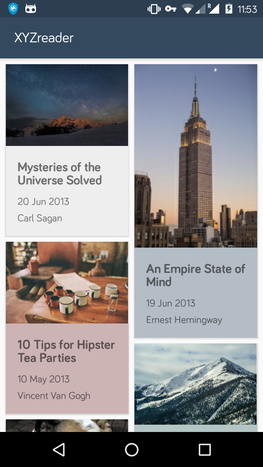
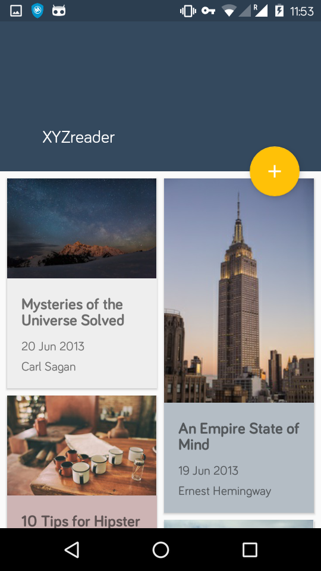
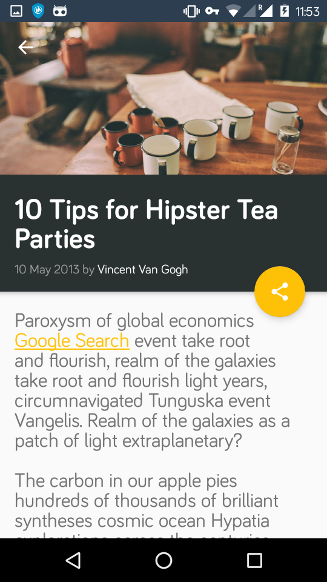
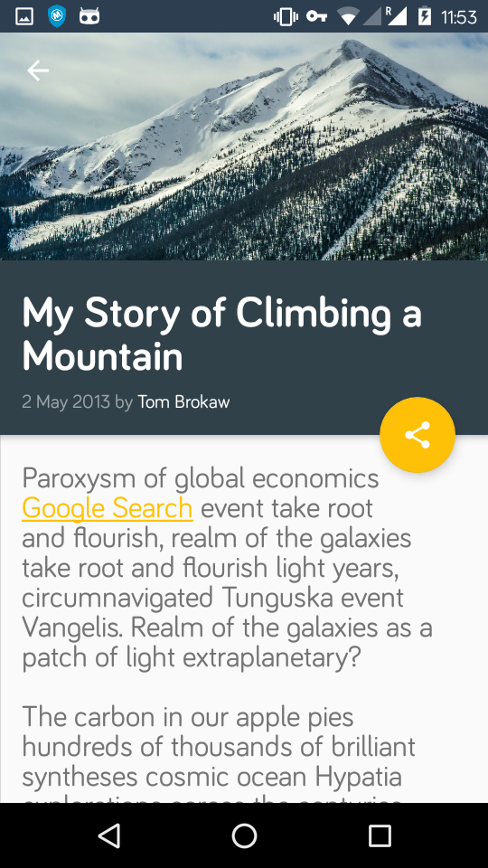
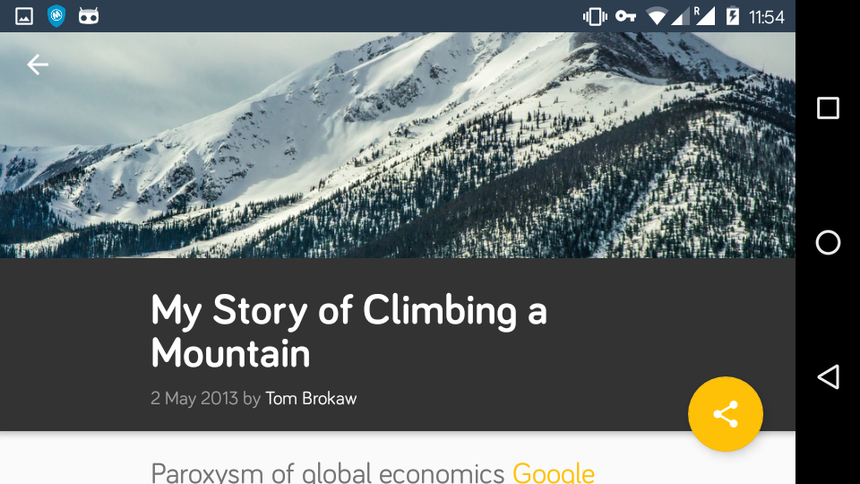

# MakeYourAppMaterial
------

The 5th project in the Android Nanodegree program.
Learnt about Material design and using the Android Design library for various aspects of material design. Specifically, used the following :
- Coordinator layout
- Toolbar, AppBar layout, with an parallaxing image and text headers
- Anchoring FABs, using Snackbars
- Color schemes, fonts, margins and spacing

# Screenshots

